# Educational Project CPP EX06
**ET-113, Институт естественных и точных наук, ЮУрГУ**  
*Автор: Степаненко А.М.*

**Компиляция:** `make run`

## Задание 1: Нормирование
> **На заданном отрезке, с заданным шагом изменения аргумента вычислить и
поместить в массив F 30 значений функции e-x
sin(6x), делённые на её
последнее положительное значение.**
### Тесты
| Диапазон     | Шаг  | Скриншот |
|--------------|------|----------|
| [0, 29]      | 1.0  | 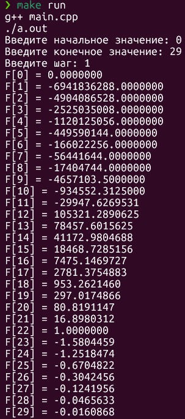 |
| [0, 2.9]     | 0.1  | 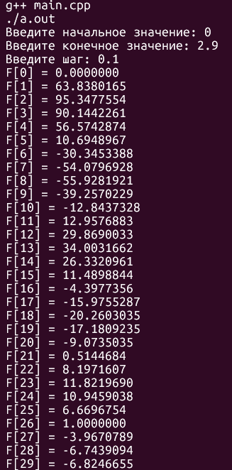 |
| [-1, 1.9]    | 0.1  | 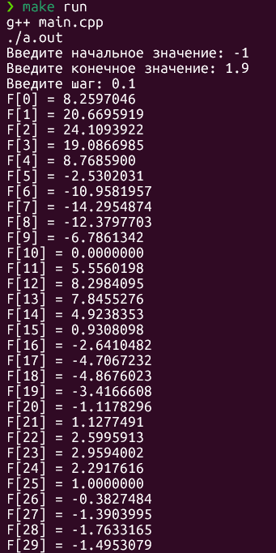 |
| [0, 14.5]    | 0.5  | 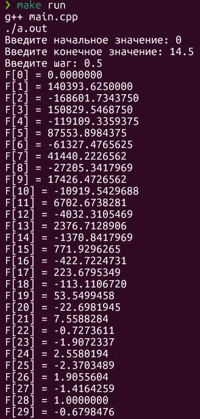 |
| [0, 0.29]    | 0.01 | 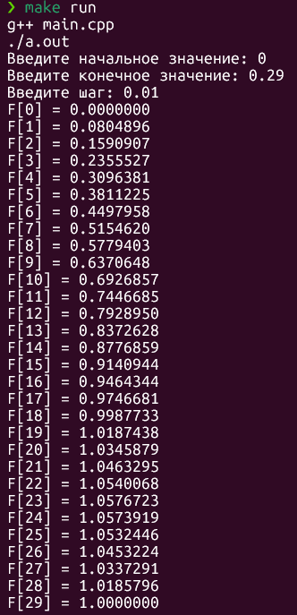 |
| [0.01,0.02]  | 0.0001|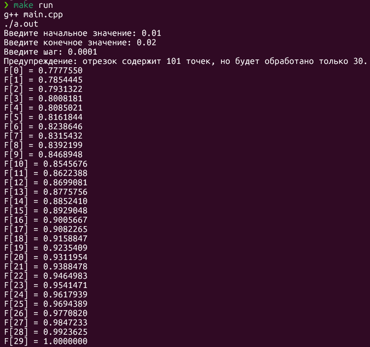|

### Исключения
| Ситуация | Скриншот |
|----------|----------|
| Буквы/равные значения | 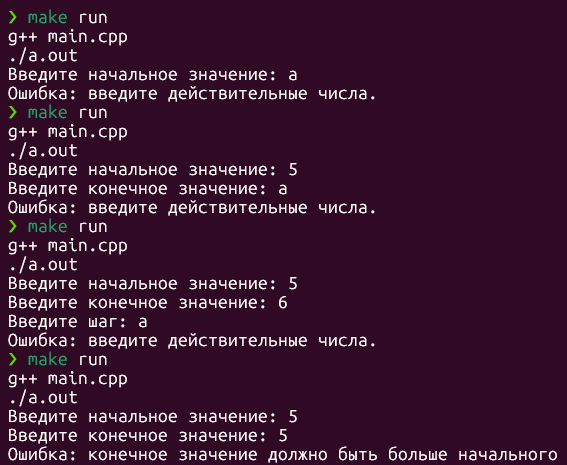 |
| Нулевой шаг | 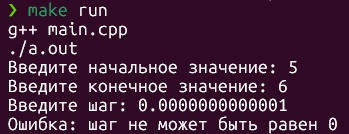 |
| Отрицательный шаг | 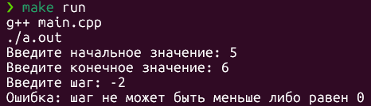 |
| Нет положительных | 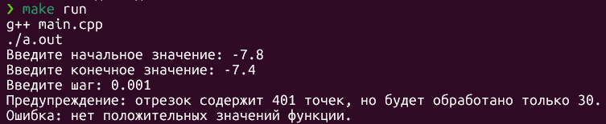 |
| менее 30 точек | 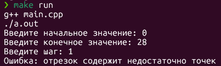 |

## Задание 2: Парсинг ФИО героев ВОВ
> **Дан текста, в котором с помощью тегов `<strong>` … `</strong>` выделены ФИО
героев ВОВ. Напишите программу, которая выводит только ФИО героев.
Учесть, что разметка может быть нарушена, то есть может отсутствовать
открывающийся тег `<strong>` или закрывающийся тег `</strong>`. Считать такие
строки не выделенными**
### Тесты
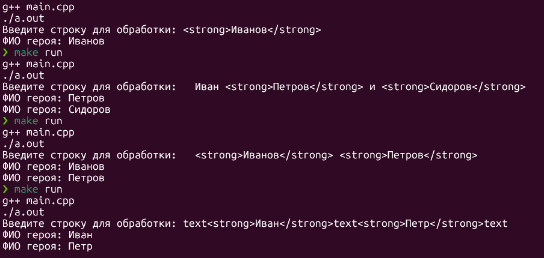
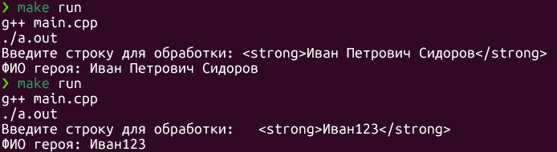
### Исключения
| Ситуация | Скриншот |
|----------|----------|
| Битые теги | 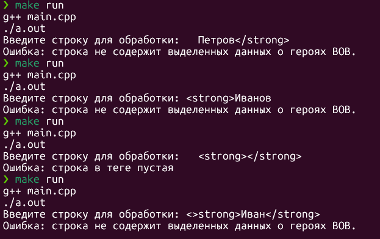 |
| Пустая строка | 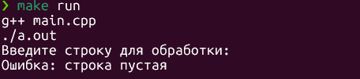 |

